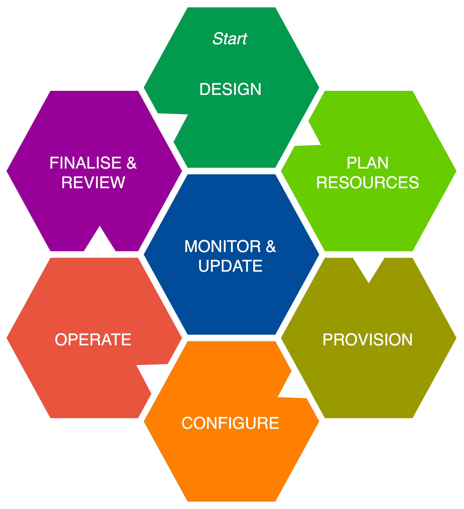
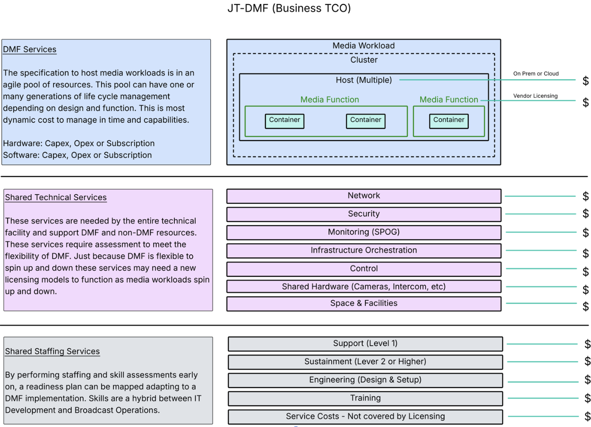

# DMF Business User Stories

_(c) AMWA 2026, CC Attribution-NoDerivatives 4.0 International (CC BY-ND 4.0)_

**JT-DMF Business Track Report**

**Version 1.0 Initial Release**

***Prepared by the JT DMF Business Track Team***  
***Workgroup Leaders: Mike Strein and Naveed Aslam***  
***September 8th, 2026***

# Executive Summary

*The purpose of the JT-DMF Business track is to provide the development teams working on both MXL and the structure for Dynamic Media Facilities a perspective from the business community.*  

*This document accomplishes this goal by analyzing user stories provided by the JT-DMF Governance group, highlighting areas where business concerns are raised, and pointing out topics which would be important to discuss with a business/technical team looking to implement Dynamic Media Facilities.*  

*A number of terms were used repeatedly during the analysis of the different stories. These common terms and our definition of those terms are provided in a Common Terms and Definitions section.  Other terms, not used in the document, are defined as they likely would be used in discussions of the User Stories.* 

*Finally, during our analysis, we developed two diagrams which we believe are helpful in understanding the User Stories. They may also prove useful in DMF business discussions.*

# Common Terms and Definitions across all User Stories

*Listed here are common terms along with their associated definitions which may be used in the expanded descriptions of all the User Stories.  If the terms are not shown in the stories below, they likely will come up in discussions within the business.*

1. **Media Functions:**  Well defined units of functionality that act on media streams, files or objects, as described in the EBU whitepaper “The Dynamic Media Facility: Reference Architecture”.    The Media Workload Lifecycle diagram from the paper is included below as Figure 1\.  
2. **\[Deployment\] Platforms:** On-prem (virtual and bare-metal), Private Cloud, Public Cloud, Multi-Cloud, Hybrid Cloud  
3. **Resources:** Anything used in a Media Facility, from physical items, to people to licenses.   
4. **Financial Models:** Capex and Opex, including subscription models (which may be either Capex or Opex) as well as Tokens  
5. **Total Cost of Ownership (TCO): (base and ongoing costs)** this includes not only the Capex or Opex model costs but also other elements such as staffing, SLA’s, along with the underlying infrastructure costs over the lifetime of the facility to host these models.  See Figure 2 below for more detail on technical components that may influence TCO.  
6. **Licensing:** The licensing method is software based, accountable, with choice (potentially as referenced by organizations such as the International Association of Media Technology, IAMT)  
7. **Intellectual Property:** It is assumed that there are guardrails for protection of IP  
8. **Metrics:** exposed for both hosting resources as well as functional applications.  This also includes metering: an auditable ability to track utilization of resources to a granular level (including such items as power and cooling).   Exposing metrics may be a licensable feature  
9. **Tiers:** typically listed as 1, 2 and 3, refer to levels of production value, with tier 1 being the highest level, requiring the most amount of production resources, and often including the need for redundancy (potentially complete replication) and resiliency (potentially multiple paths).  Tiers 2 and 3 often require decreasing amounts of resources, less sophisticated production values, and can typically accept a larger amount of risk in production.

# Additional Considerations

*Listed here are terms along with their associated definitions which may not be mentioned in the User Stories but may help in the discussions of them.*

1. **Accountability**: The user assumes responsibility for functional system performance.  Vendors or Independent Software Vendors (ISVs) are accountable for functional elements within the system.

2. **Benefit/Risk assessment**: judging the acceptable amount of risk, across tiers (tiers are defined in definition 15)

3. **Security:** models for DMF may differ from traditional models in how information security is managed.  Requirements may change by geographical region and need to be assessed individually.  Other groups within the JT-DMF are looking at “Threat Modeling”

4. **Accessibility, Supportability and Complexity**: similar to security, DMF models may also differ in in their ability to enable and sustain workflows when compared with traditional models

5. **Escalation**: a process and structure for issue resolution going up the stack both from the owner and then up through the vendor sectors.  This should be agreed upon prior to construction of the facility

6. **Transition**: a new purpose-build facility or migration from traditional models to DMF

**Note**: *While AI is not specifically referenced in any of the User Stories, it is generally accepted that AI could be used in customization or selection in any of the User Stories*

# Reference Diagrams

**Figure 1: Media Workload Lifecycle (from the EBU DMF Reference Architecture v2.0, April 2026, (c) EBU 2026, CC BY-ND 4.0)**

**Figure 2: Technical components affecting TCO**

This diagram is intended to provide a visual representation of the many aspects influencing the Total Cost of Ownership in any type of Media Facility.  It shows both Capex and Opex components that occur in both initial and ongoing operations.  Individual facilities may not consist of every element described in this diagram, but this should provide a typical reference for Media Facilities.  Note that this can indicate underlying costs from using existing infrastructure, as opposed to a green field build.

# User Stories

*Each of the Eleven User Stories described in this section tries to describe a specific and unique business perspective from a variety of viewpoints.  These are intended to illustrate scenarios in which potential use cases for DMF would create business discussions.  User Stories are in the format: As a \[ROLE\], I want to \[FUNCTION\], so that \[BUSINESS VALUE\].*

1. *As a senior technical manager, I need example financial and deployment models so that I can explore Total Cost of Ownership estimates as part of the acquisition process for Dynamic Media Facilities.*

    - **Story Title:** *TCO from a Client Perspective*

    - **Objective:** *Create Financial and Deployment Models to explore TCO estimates*

    - **Unique Requirements of this Story:**  Financial models that show deployments in Capex and Opex are required.  These should include all the necessary elements for the media functions and should be able to scale and support various tiers of activity in terms of the definition of the Media Function.  This likely requires the underlying infrastructure support costs as well as the application costs.  From this information it should be possible to show a cost analysis across multiple scenarios so that comparisons can be made to traditional models.  Duration and segmentation of the lifecycle are important considerations.

2. *As a senior technical manager, I need example financial models (Capex, Opex, etc.)  for Dynamic Media Facilities, so that I can have informed discussions with procurement and finance people in my organization, and so that I can clearly articulate the fundamentals of my business requirements to my vendor team.*  
   

    - **Story Title:** *Financial Models from a Client Technical Perspective*

    - **Objective:** *Create Financial Models for business requirement discussions within the company.  Once selected, that model should be used to communicate business financial requirements to vendors*

    - **Unique Requirements of this Story:**  Similar to \#1, this requires financial models that show deployments in Capex and Opex.   The emphasis will be on the financial portion of the models and how they present both initial and recurring costs.    A comprehensive understanding of all the elements in a Dynamic Media Facility is required so that comparisons can be made to traditional models. This necessitates not just justification but understanding of the production needs such as the lifecycle, staffing, etc., so that people in the organization understand the total picture.   The technical requirements and components, likely as referenced in associated included diagrams (Figures 1 and 2), add up in the decision-making process to determine which model is preferred.  Particular emphasis should be focused on Figure 2, which shows elements of the TCO, and provide specifics that contribute to potential costs, as well as other specific company data, such as if this an addition to an existing build or a “greenfield” build. This data can then be used in generating documents such as RFPs, that would typically come from the procurement team.  Do the flexible attributes of a DMF model bring functions to the user that make it worthwhile to move from a more traditional model?  The data generated should be able to provide those answers.

3. As a senior technical manager or senior systems engineer, I need example deployment models (on-prem, off-prem, cloud, etc.) for Dynamic Media Facilities, so that I understand my options and can evaluate those options against internal plans for new facilities and consolidation.

   

    - **Story Title:** *Example Deployment Models from a Technical Perspective*

    - **Objective:** *Create the potential Deployment Models that can be considered options for a business, taking into account the unique requirements of the business*

    - **Unique Requirements of this Story:**  This requires a distinct deployment model for each type of platform to host Dynamic Media Facilities that can then be used to compare to more traditional types of deployments.  The emphasis is from a technical perspective and should be able to show the differences (advantages or disadvantages) between these types of deployments.  The architecture of each type of deployment model should be examined, detailed and then compared against a traditional model.  All facets of these models need to be examined so that one can weigh the predominantly technical benefits of each.  Influencing factors to be taken into consideration may include future technical and production direction of the company.  Considerations should also include impacts and tradeoffs to existing facilities and/or infrastructure, as well as staffing, especially when weighed against the company’s plans for future expansion/consolidation.  Resiliency and redundancy may be important criteria in these models.

4. *As a vendor, I need example financial and deployment models so that I can educate my customers about options available for Dynamic Media Facilities, and help shorten the acquisition process.*  
   

    - **Story Title:** *Example Financial/Deployment models from a Vendor Marketing Perspective*

    - **Objective:** *Create the example Deployment and Financial models that a vendor can deliver, so that it is clear to a customer what options are available*

    - **Unique Requirements of this Story:**  This requires comprehensive example financial and deployment models such that the vendor can show their proposed advantages over both traditional models and their competitor’s models.  Pricing models are key to show the costs, certainly from a TCO perspective but also from other perspectives such as staffing, support and education.  What is the value-add and/or benefits of these models – i.e.; flexibility in licensing, quick deployments, quick tear-down, etc.  How can the licensing model become an enabler instead of an obstacle. There are many key points that a vendor should be able to describe and promote including simplicity, interoperability, flexibility, agility, potential for growth, and the potential for customization.  With customization, the responsibility for support may fall to the customer.

5. *As a producer/show runner, I need example financial and deployment models to predict the cost of the needed infrastructure/technical resources for a production, so that I can make well-informed decisions about overall production costs.*  
   

    - **Story Title:** *Financial/Deployment Models that translate directly to estimated Production Costs*

    - **Objective:** *Create the Financial/Deployment Models that clearly indicate ongoing costs to the production they host*

    - **Unique Requirements of this Story:**  This requires comprehensive deployment models that show not just the costs to deploy a Dynamic Media Facility, but also the requisite infrastructure support costs as well as any other impact costs that show the differences as compared to a traditional production.  Essentially this would become the rate card for a DMF facility vs a traditional one, which is often shown as cross-charges within a company (see sample rate cards below)**.**  Particular emphasis should be around recurring costs such as for SLA’s and staffing, as indicated in the common elements.  Variable costs versus fixed costs (as an analogy, owning a car vs UBER), which may not just be a comparison between capex and opex.  Production viewpoints may differ from technical, financial and executive viewpoints of the business, so it is important understand the underlying/ongoing support and infrastructure costs to support the production.

    #### Sample Traditional Facility Rate Card for a Production Studio

    | Resource | Billing basis | Quantity | Special request | Rate |
    |---|---|---|---|---|
    | Studio Space | Per square foot |  | Studio audience |  |
    | Cameras | Individual |  | Standard, jib, HH |  |
    | Microphones | Individual |  | Lavalier, hard wired |  |
    | Lighting | Individual |  | Instrument type |  |
    | Control Room | Room type |  | Live, tape |  |
    | Crew | Per head |  | Staff/freelance |  |
    | Electricians | Per studio |  | Special needs |  |
    | Stage Hands | Per studio |  | Special needs |  |

    #### Sample Media Function Rate Card for a Dynamic Media Facility

    | Media function | Billing basis | Quantity | Special request | Rate |
    |---|---|---|---|---|
    | Frame Rate Conversion | Per channel |  |  |  |
    | Coloring Services | Per channel |  |  |  |
    | Editing Systems | Per channel |  |  |  |
    | Audio Processing | Per channel |  |  |  |
    | Audio Mixing | Per channel |  |  |  |
    | Storage | Per channel |  |  |  |

6. *As a producer/show runner, I want to know what my deployment options are for less urgent near-live/non-live production, so that I can reduce my production budget.*  
   

    - **Story Title:** *Financial/Deployment Models for Non-Critical Production*

    - **Objective:** *Create Financial/Deployment Models for lower tier productions and provide detail on the potential trade-offs in moving between different options*

    - **Unique Requirements of this Story:**  This requires comprehensive deployment models that show the costs of a Dynamic Media Facility in tiered scenarios, ranging down to lower budget solutions.  These should have the effect of minimizing the required resources and potentially lowering the cost of a production when compared with traditional productions.  All elements that affect cost still need to be considered.  This should show how Dynamic Media Facilities enable efficiency that could translate to lower costs, easier deployment of resources, differing production values and enable differing tiers of production.

7. *As a senior technical manager, I need a deployment model that supports a license model without Internet connectivity. (vendors need this too)*  
   

    - **Story Title:** *Deployment Models without Internet Connectivity*

    - **Objective:** *Enable Deployment models that can continue to provide licensing in the absence of Internet Connectivity*

    - **Unique Requirements of this Story:**  Likely this example exists mainly in an “on-prem” environment (although this may be mobile), and for reasons required by the client, needs to function without internet connectivity.  Most other elements are still required but this would be unique in that all licensing needs to be tracked, collected, aggregated and then requires a method of reporting back to the vendor for consolidating the usage, possibly via proxy.  The service may need to aggregate multiple license data from multiple vendors.  Perpetual site licenses, if an option, could solve this.  These requirements need to be discussed and provisioned up front.  As an aside, this capability may also be required for tracking OPEX resources as well.

8. *As a senior technical manager, I need deployment models that support the ability to scale up or down resources and licenses, so that I can deliver the right amount of production facilities just in time.*  
   

    - **Story Title:** *Deployment Models that can scale dynamically*

    - **Objective:** *Create Deployment Models that can scale both licenses and resources dynamically*

    - **Unique Requirements of this Story:**  there will be multiple versions of deployment models depending on where they are hosted – obviously private/public/hybrid cloud models should support this somewhat natively.  On-prem models would likely require over-provisioning of infrastructure resources to support this model.  Limits should be in place to prevent scaling errors – thresholds or limits for the amount of resources the user would not want to exceed (financially, technically and operationally).  License and resource usage needs to be aggregated for reporting back to the required vendors.  Metrics on the usage needs to come back to the business as well.  Approval, time required to scale, etc., all needs to be taken into account in this Story.

9. *As a producer/showrunner, I need deployment models that provide the media functions to support a production, using technology with a cost that matches the value of the production. (Tier 1, 2, 3 production)*  
   

    - **Story Title:** *Deployment Models for different production tiers*

    - **Objective:** *Show the differing levels of Deployment Models from a value/cost versus technical resource perspective*

    - **Unique Requirements of this Story:**  (for specific reference on Tiers, see the definition in the Terms and Definitions Section).  This requires deployment models that can vary by several factors, such as models with limited functions/features, models hosted in a variety of platforms and models that accept a degree of risk.  The producer/showrunner can then make an assessment of what is optimal for the required tier of production.  Likely the this needs to be charted along multiple axes with segmented ranges to determine the specific requirements of each tier.  (a simple diagram would help)

10. *As a media company executive, I want financial and deployment models that support the ability to quickly create new media product offerings at low cost so that I can determine their viability, and then either harden and scale them up or shut them down based on market acceptance.*  
    

    - **Story Title:** *Dynamic Financial/Deployment Models for Executive Decision-making*

    - **Objective:** *Create Financial/Deployment Models that clearly show costs and ability to migrate between models and/or shut them down*

    - **Unique Requirements of this Story:**  Similar to User Story 5, this takes the executive viewpoint instead of the production viewpoint, meaning the focus may be more on financials for the business than on the production resources.  Example scenarios for these models include a show that takes off and suddenly requires many more technical resources or conversely, a show that loses viewers and either moves to a different transmission platform or may be canceled entirely.  This requires models that are agile, such as in functions, features, risk and hosting initially, and continue to be agile such that all of these can be scaled across all layers in capability or potentially shut down.  The elements supporting these models likely need to be defined in a much more granular method, as the time the model exists in its early state may be short – this is what provides value to the media executive.  Essentially, this relates to an initial cost of entry that can then be migrated based on the needs of the business.

11. *As a senior technical manager, I want the ability to move an existing production from the public cloud to on-prem without reconfiguration, so that I can become agile in selecting the deployment platform.*

    

    - **Story Title:** *Deployment Models that can migrate between hosting platforms*

    - **Objective:** *Create Agile Deployment Models, that can move between hosting platforms without the need to completely rebuild*

    - **Unique Requirements of this Story:**  This requires the deployment models to be extremely portable (potentially platform agnostic), and as such the vendor needs to support all types of deployment models so that the client can migrate these somewhat seamlessly.  As these deployment models are likely quite different, the customer needs to select a vendor that supports portability or be ready to switch vendors as needed.  The functions that are to be ported, and time to redeploy, are concerns in transitioning between platforms.   Proprietary services (vendor specific features) need to be understood to avoid vendor lock-in.  Asking these questions up front in the initial deployment will determine whether the production, resources and license models are transportable.  These concerns are both architectural (in terms of the potential required infrastructure changes), operational (in terms the variance in needs between platforms) of and financial (in terms of the cost models).
